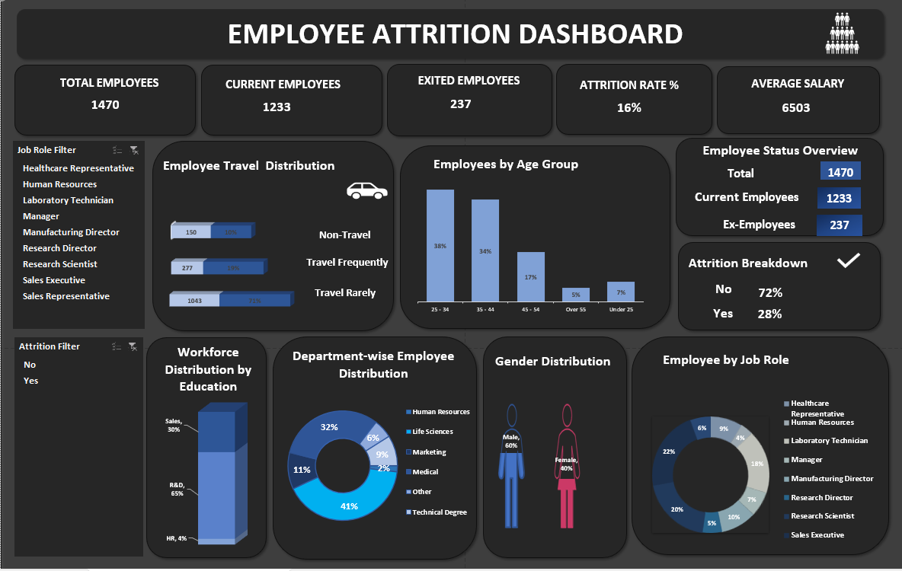

# Employee Attrition Dashboard

## Project Overview
This Excel dashboard analyzes employee attrition and workforce distribution across age group, gender, department, job role, education, and travel frequency.

## Tools Used
- Microsoft Excel
- Pivot Tables
- Pivot Charts
- Slicers
- KPI Cards
- Dashboard Design

## Key Metrics
- Total Employees: 1470
- Current Employees: 1233
- Exited Employees: 237
- Attrition Rate: 16%
- Average Salary: 6503

## Key Insights
- Highest employee count is in the 25–34 age group
- Travel Rarely employees form the largest group
- Attrition analysis helps identify risk areas

## Dashboard Preview

## Project Files
- Employee_Attrition_Dashboard.xlsx
- dashboard.png
